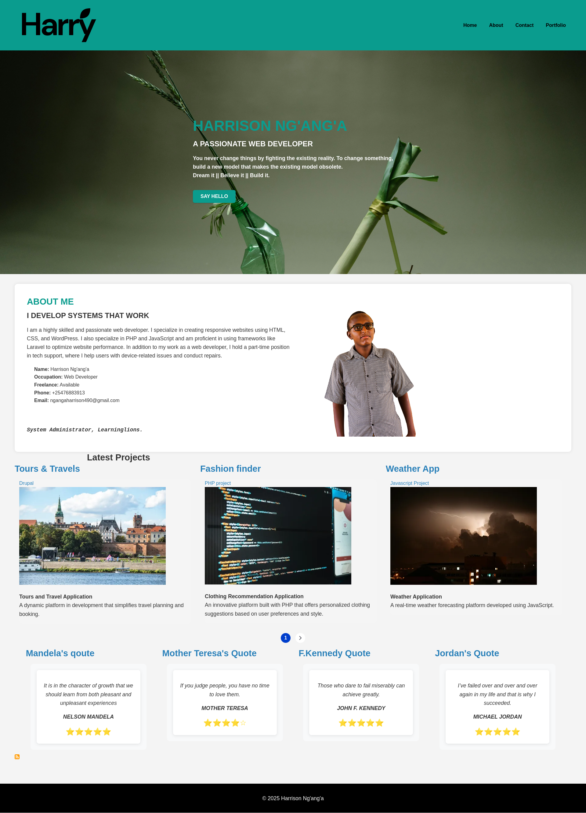
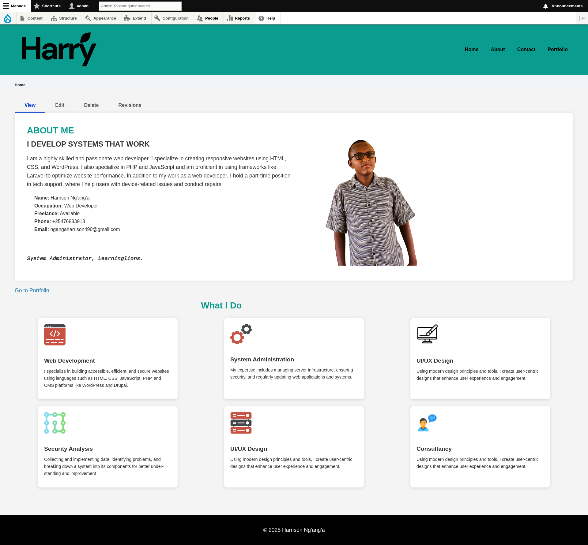
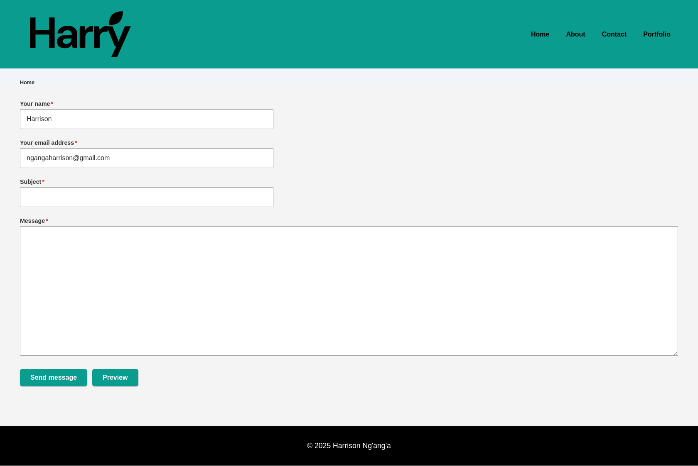
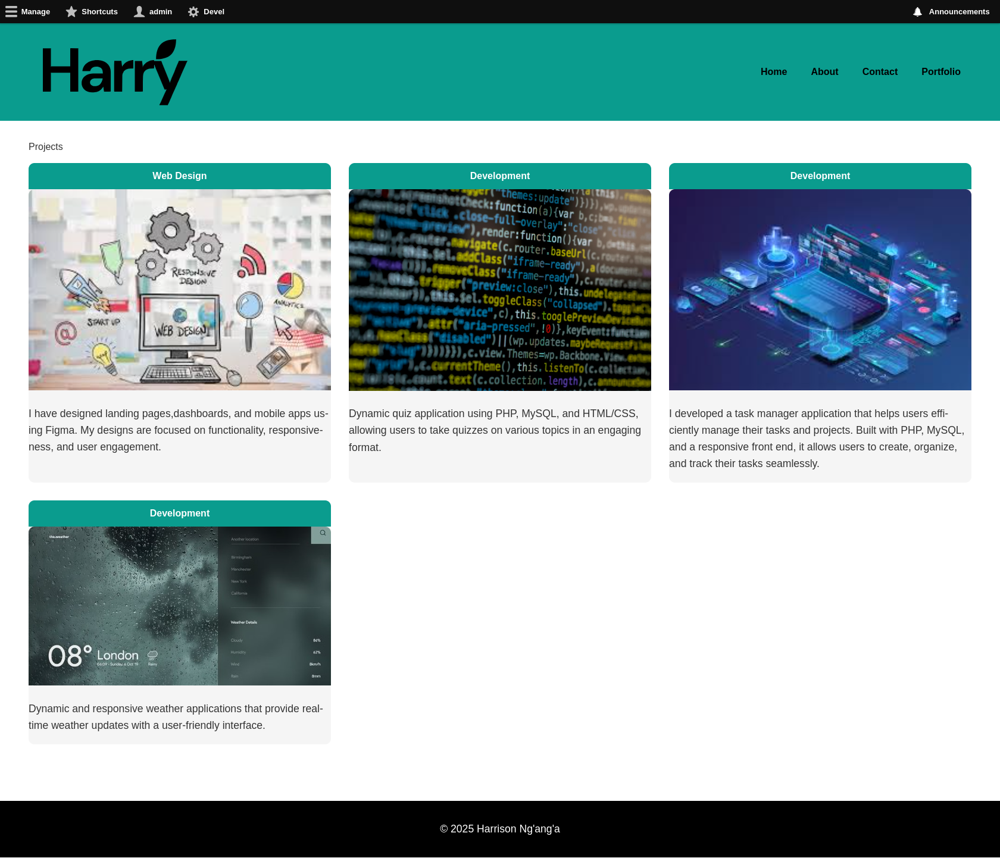

# 🎨 Drupal Portfolio Website

A custom-designed portfolio site built with Drupal, featuring a tailored theme and dynamic content sections.


*Homepage showcasing custom theme and layout*

## ✨ Key Features
- Custom **Claro-based theme** with personalized CSS and templates
- Responsive design for all devices
- Portfolio section to showcase your work
- Contact form integration

## 🛠️ Quick Setup (DDEV Local)

1. **Prerequisites**:
   - Docker ([Install Guide](https://docs.docker.com/get-docker/))
   - DDEV (`brew install ddev` or [other methods](https://ddev.readthedocs.io/en/stable/))

2. **Get Started**:
   ```bash```
   git clone [your-repo-url] portfolio-site
   cd portfolio-site
   ddev start
   ddev import-db --src=database-file-folio.sql.gz
   ddev composer install
   ddev drush uli
## 🎨 Theme Customization Highlights

1. File Structure
web/themes/custom/folio/
├── css/
│   ├── style.css       # Global styles
│   ├── project.css     # Portfolio specific
│   └── service.css     # Services section
├── templates/          # Custom Twig templates
├── folio.info.yml      # Theme metadata
└── folio.libraries.yml # CSS/JS assets


## 📸 Site Screenshots
# About

# Contact

# Portfolio

